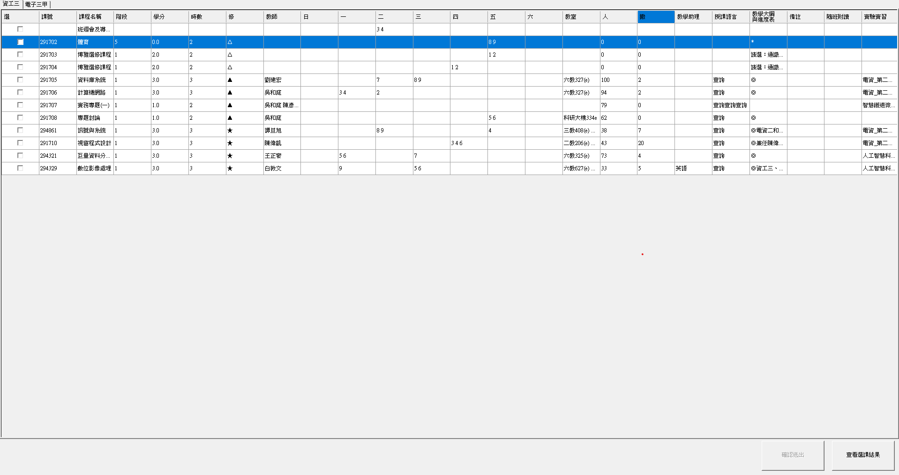
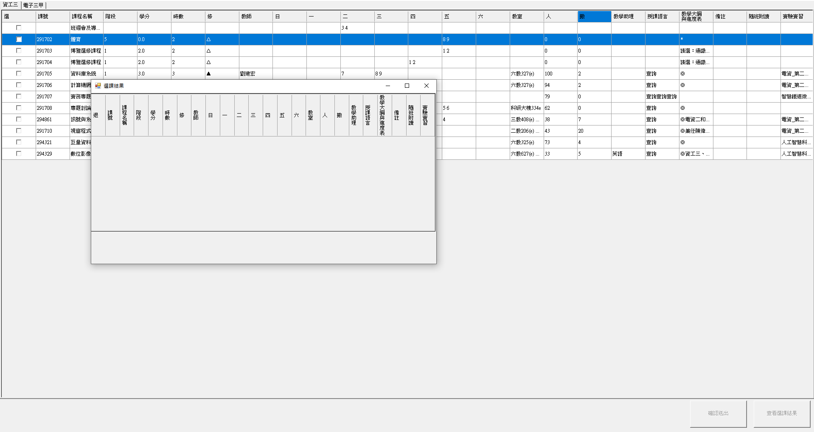
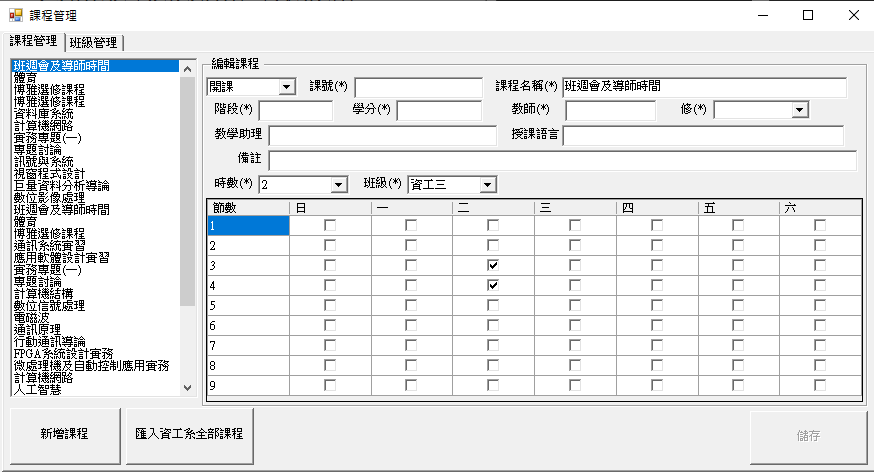

# WindowsForm_PartI

這是一個使用 C# 製作的 Windows Form 應用程式，主要功能是從網路上爬取課表資料，並提供一個簡易的選課模擬介面

## 專案目的

此專案為課堂作業，目的是練習 C# 與 Windows Form 的使用

## 技術細節

- 語言：C#
- 框架：Windows Forms (WinForms)

## 頁面展示

### 主介面

主畫面包含選課系統與課程管理系統，使用者可模擬不同系統

### 選課系統介面

根據網站爬取課程後，自動整理成結構化的表格，提供用以選取課程，並且可以查看送出後的選課結果

### 課程管理系統介面

根據網站爬取課程後，自動整理成結構化的表格，用以模擬課程管理系統

